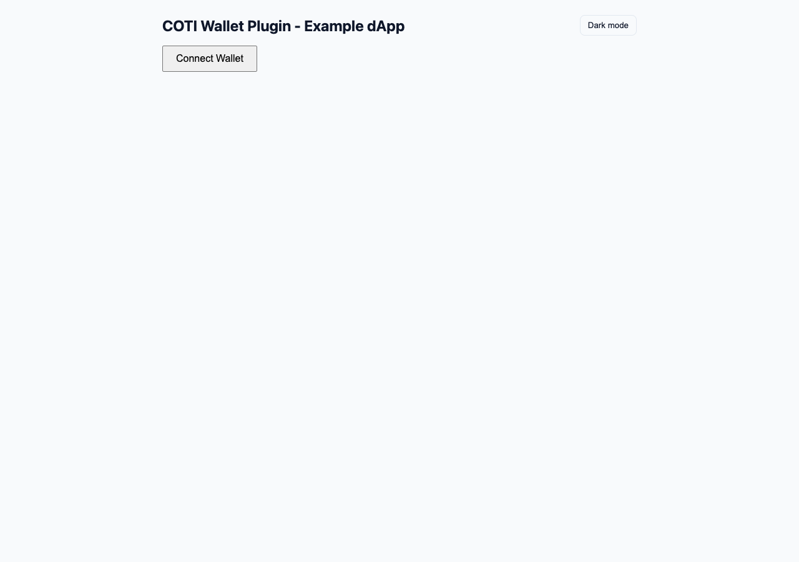

# Example App

A minimal React app ships in the [coti-wallet-plugin GitHub repository](https://github.com/coti-io/coti-wallet-plugin/tree/main/examples). It connects a wallet via RainbowKit and displays public and private token balances from the [COTI Token List](https://github.com/coti-io/coti-token-list).

<figure><figcaption><p>Example dApp with Connect Wallet and unlock controls</p></figcaption></figure>

## Prerequisites

* Node.js 18+

## Setup

```bash
git clone https://github.com/coti-io/coti-wallet-plugin.git
cd coti-wallet-plugin/examples
cp .env.example .env
```

Edit `.env` and add your WalletConnect project ID (get one at https://cloud.walletconnect.com):

```
VITE_WALLETCONNECT_PROJECT_ID=your_project_id_here
```

## Run

```bash
npm run dev
```

This installs dependencies in the plugin root and examples, rebuilds the wallet plugin, then starts Vite. Use `npm run dev:vite` to skip install/build and start Vite only.

Opens at http://localhost:5173

Use the **Light mode / Dark mode** button in the header to preview onboard-modal theming. The example passes `privateUnlock.theme` built from `src/onboardTheme.ts` — the same pattern host apps should use.

### Local Snap development

To run against a local `coti-snap` server:

```bash
# Requires coti-snap cloned as ../coti-snap with yarn install done
npm run dev:local-snap
```

This starts:

* `coti-snap` watch server at http://localhost:8080
* Snap companion dApp at http://localhost:8000
* Wallet example at http://localhost:5173 with `VITE_SNAP_ID=local:http://localhost:8080`

Override the snap checkout path with `COTI_SNAP_ROOT` if needed.

## What it does

1. **Connect Wallet** — Opens the RainbowKit modal (MetaMask, Coinbase, WalletConnect, etc.)
2. **Public Balances** — Reads on-chain ERC20 `balanceOf` for all public tokens on the connected chain
3. **Native COTI** — Displays native COTI balance via wagmi
4. **Private Balances** — Click **Unlock Private Balances** to derive the AES key, then decrypted private token balances appear

## Network

The app targets **COTI Testnet** (chain ID 7082400) by default. Switch your wallet to COTI Testnet to see token balances.

## Related docs

* [Integration Guide](integration-guide.md)
* [Configuration](configuration.md)
* [AES Key Onboarding](aes-key-onboarding.md)
