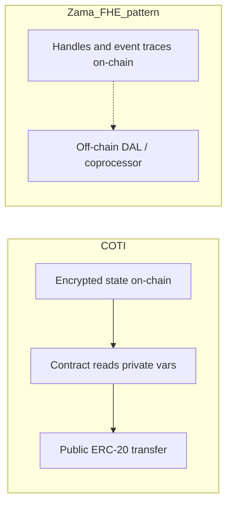

# On-chain data availability

COTI is a privacy blockchain: **encrypted data lives on-chain** as first-class contract state. Contracts can read private variables, compute on them, and combine those results with public actions in the same control flow.

Zama’s FHE model (as commonly deployed for confidential tokens) keeps **handles and execution traces** on-chain while bulk ciphertext and private execution sit with an off-chain privacy service / DAL (data availability layer) and coprocessor. What explorers see is often a log of requests — not private values the EVM contract can treat like ordinary readable state when deciding a public side effect.

## Why it matters

If private data cannot participate in on-chain decision-making alongside public state, many product patterns break: payouts gated on private tallies, private eligibility that triggers a public ERC-20 send, or any flow where the contract must **branch on a private result and then touch a public token**.

| | COTI | Zama FHE pattern (typical) |
| :- | :--- | :------------------------- |
| Where ciphertext lives | On-chain private state (`gt*` / user `ct*`) | Handle on-chain; blob / DA off-chain |
| Contract reads private vars | Yes — native to the execution model | Handle ops via FHE API; not “plain” private storage for public branching the same way |
| Private → public in one flow | Supported (compute privately, then public call) | Public transfer gated on a private tally is not a natural same-tx pattern |



## Example: private votes, public claim

Users privately vote for candidates. A candidate later claims a public ERC-20 (e.g. EUDC) proportional to votes received. On COTI this is a normal pattern: the contract holds encrypted tallies and, on `claim`, uses the private result to drive a public transfer.

Illustrative pseudo-code (not production):

```solidity
// SPDX-License-Identifier: MIT
pragma solidity ^0.8.19;

interface IERC20 {
    function transfer(address to, uint256 amount) external returns (bool);
}

/// @notice Illustrative only — shows private state gating a public ERC-20 send.
contract PrivateVotePublicClaim {
    IERC20 public immutable rewardToken; // e.g. EUDC

    // Encrypted tallies live as on-chain private state (COTI gt* / equivalent).
    // mapping(candidate => encryptedVoteCount)
    mapping(address => uint256 /* stand-in for gtUint256 */) private votes;

    mapping(address => bool) public claimed;

    constructor(IERC20 rewardToken_) {
        rewardToken = rewardToken_;
    }

    /// @dev User submits an encrypted ballot (it* validated on-chain on COTI).
    function vote(address candidate, /* itUint256 */ uint256 encryptedOne) external {
        // validateCiphertext(encryptedOne) → add into votes[candidate]
        votes[candidate] = /* privateAdd(votes[candidate], validated) */;
    }

    function claim() external {
        require(!claimed[msg.sender], "already claimed");
        claimed[msg.sender] = true;

        // Private tally is readable to the contract's private execution.
        uint256 amount = /* privateRevealOrUse(votes[msg.sender]) */;
        // In a fully private design, amount may stay encrypted until a
        // controlled reveal; the point is the contract can use the private
        // result to size the public payout in this flow.

        // ★ This public ERC-20 send, gated on the private vote result,
        //   is natural on COTI. In the typical Zama handle / off-chain DAL
        //   model there is no equivalent synchronous private-state read
        //   that can gate a public ERC-20 transfer in the same on-chain
        //   control flow — the contract does not hold the private tally
        //   as ordinary on-chain private state for that decision.
        require(rewardToken.transfer(msg.sender, amount), "transfer failed");
    }
}
```

**Highlight:** the `rewardToken.transfer(...)` line (marked ★) is the line that does not work in the usual Zama deployment pattern for this use case. There is no way for the contract to know the private vote results as on-chain private state and, in the same control flow, send a public ERC-20 reward sized by that result. COTI’s on-chain encrypted state makes that combined private→public decision a first-class pattern.

Related reading: [Compatibility and divergence](compatibility-and-divergence.md), [Privacy on Demand architecture](../privacy-on-demand/architecture-and-components.md).
