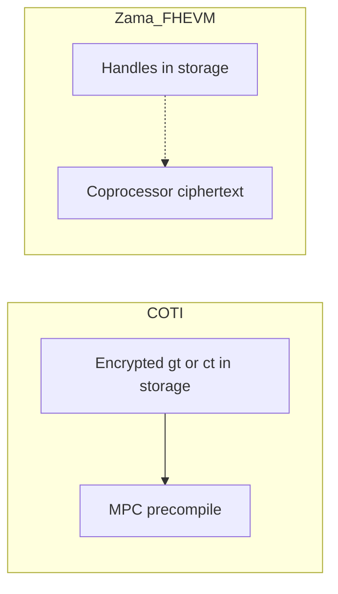

# On-chain data availability

Encrypted **balances** are contract state on both stacks. What differs is **where the bulk ciphertext lives**, and whether a contract can turn a **private** predicate into a **public** `if` in the **same** transaction.

## Where private data lives

| | COTI | Zama / FHEVM (pinned stack) |
| :- | :--- | :-------------------------- |
| What explorers see | Encrypted `gt*` / `ct*` words in storage (two 32-byte limbs for `ctUint256`) | 32-byte **handles**; ciphertext with coprocessors |
| Contract math on private values | MPC precompiles on `gt*` | FHE ops on handles (`FHE.add`, `FHE.select`, …) |
| User-readable ciphertext | `ct*` on-chain, AES-decrypt on the client | Handle on-chain; user decrypt via Relayer / KMS |



## Private vs public control flow

Three different questions:

1. **Encrypted branching** — pick ciphertext A or B without revealing the bit (`mux` / `FHE.select`). Both stacks do this in the transaction that runs the FHE/MPC op.
2. **Public branching** — a plaintext `if`, a public ERC-20 `transfer`, an event that discloses an amount. That needs a **plaintext**.
3. **When the plaintext exists** — same transaction, or a later one.

| Path | Same transaction as the private compute? | Notes |
| :--- | :--- | :---- |
| **Native COTI** (gcEVM) | Yes | Contract can decrypt inside the call (`SetPublic` / garbled-circuit reveal) and then branch or send a public token. See [Advantages over FHE](../how-coti-works/advanced-topics/coti-vs-others.md#advantages-over-fhe). |
| **PoD host-chain tokens** | No | Private work runs on COTI. The host contract sees the result in an **Inbox callback** ([Async private operations](../privacy-on-demand/async-private-operations.md)). |
| **Zama FHEVM** | Encrypted: yes (`FHE.select`). Public: no | [Zama branching](https://docs.zama.org/protocol/solidity-guides/smart-contract/logics/conditions): moving from an encrypted condition to non-encrypted logic **requires off-chain public decryption**, then a **later** host tx (`FHE.checkSignatures` / `finalizeUnwrap`-style callbacks). |

OpenZeppelin confidential wrappers follow that two-transaction public path (for example `unwrap` then `finalizeUnwrap`; swap then `finalizeSwap`).

## Example: private tally, public payout

On **native COTI**, a contract can hold encrypted tallies and, in `claim`, decrypt (or mux) and send a public ERC-20 in the **same** call.

```solidity
function claim() external {
    require(!claimed[msg.sender], "already claimed");
    claimed[msg.sender] = true;
    // Native COTI: private result can become public in this call.
    uint256 amount = /* decrypt or controlled reveal of votes[msg.sender] */;
    require(rewardToken.transfer(msg.sender, amount), "transfer failed");
}
```

On **Zama**, the auction/prize pattern in the FHEVM docs is: encrypted bids with `FHE.select` during the sale, then `makePubliclyDecryptable` / off-chain decrypt, then a **second** function that verifies KMS signatures and transfers the prize.

On **PoD**, a host-chain pToken transfer is already request → COTI → callback. A public ERC-20 send gated on a private host-chain tally uses that same two-step Inbox path, not a native same-tx decrypt.

Related: [Compatibility and divergence](compatibility-and-divergence.md), [Concurrency](concurrency.md), [Privacy on Demand architecture](../privacy-on-demand/architecture-and-components.md).
