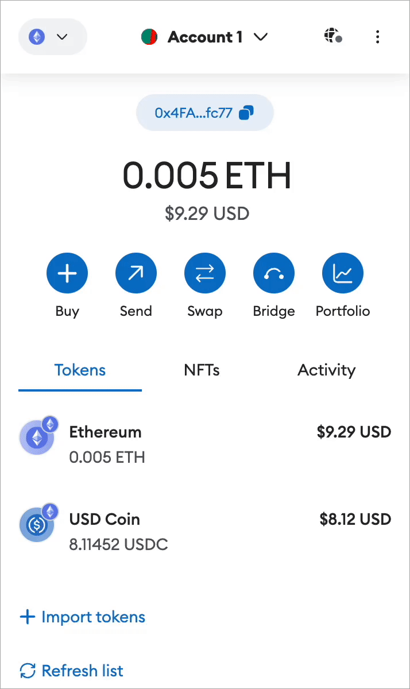

# Devnet

Follow the instructions provided below, sourced from the MetaMask website.


For more information go to this metamask link


1. **Install MetaMask**: If you haven't already, install the MetaMask browser extension for your web browser.
2. **Open MetaMask**: Click on the MetaMask icon in your browser's toolbar to open the MetaMask extension.
3. **Add Network**: Click on the network selector button. This will display a list of networks that you've added already. Then click on Add network.

<figure><figcaption></figcaption></figure>

4. **Add Custom RPC**: From here, find and the 'Add network manually' button at the bottom of the network list.

<figure><figcaption></figcaption></figure>

5. **Enter Network Details**: In the 'Add network manually' screen, enter the following details:

<figure><figcaption></figcaption></figure>

* Network Name: **Soda Labs**
* RPC URL: **node.sodalabs.net**
* Chain ID: **50505050**
* Symbol: **SOD**
* Block Explorer URL: **https://explorer.sodalabs.net**

6. **Save**: Click "Save" to save your custom network settings.
7. **Switch to Devnet**: Once you've added the custom network, select it from the network dropdown to switch to soda devnet.
8. **Connect**: You should now be connected to soda devnet using MetaMask. You can start interacting with the network by sending transactions, deploying smart contracts, and more.
