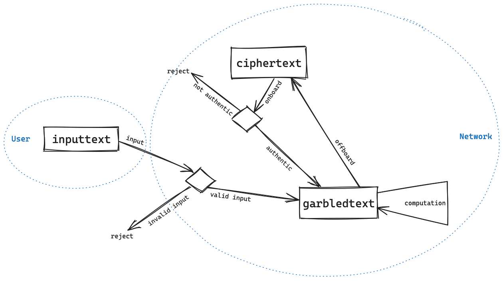

# 🪄 Secure Data Types

The gcEVM extends the capabilities of the EVM across various dimensions. Initially, it introduces novel data types to accommodate the necessity of maintaining confidentiality. Subsequently, it introduces additional operations capable of manipulating these confidential data types without compromising their secrecy.\

## Data Types&#x20;

To support confidentiality, we introduce a new set of data types mirroring the existing solidity types with size of up to 64 bits.\
We present three new types needed for manipulating private smart contracts:

* Inputtext (itBool, itUint8, itUint16, itUint32, itUint64)
* Ciphertext (ctBool, ctUint8, ctUint16, ctUint32, ctUint64)
* Garbledtext™(gtBool, gtUint8, gtUint16, gtUint32, gtUint64)

We make a distinction between secret data types that are used for security ‘at rest’, ‘in transit’, or ‘in use’. That is, while the ciphertext data type (denoted CT) are used to secure data at rest, we use the inputtext data type (denoted IT) for protecting data in transit and the garbledtext™ data type (denoted GT) for protecting data in use.\


Detailed examples of these types are presented in  the following link



[private-erc20-example](../private-smart-contracts-development/private-erc20-example/)


Usage\

* **Inputtext** is used when a user initially presents encrypted data to the gcEVM. It undergoes initial validation and subsequently gets transformed into "garbledtext" for subsequent computations.
* **Garbledtext™** is used either in operations or by passing secret data from contract to contract.It's important to note that these values are temporary and valid only throughout the execution of the transaction, being promptly deleted once execution concludes. To preserve such secret data, it must be converted into ciphertext.
* **Ciphertext** is the format utilized for storing data in storage by transitioning from garbledtext, and conversely, it is transformed into garbledtext through onboarding.&#x20;

## &#x20;Life-cycle of private data within the gcEVM

<figure><figcaption>
Transition between secret data types
</figcaption></figure>


It's essential to acknowledge that without a security mechanism in place, there's a risk of potential malicious exploitation of these types. To mitigate such risks, the gcEVM incorporates a security mechanism aimed at preventing any dishonest activities, such as unauthorized copying of secret data. For more information about the security mechanism please refer to the white paper.


##

