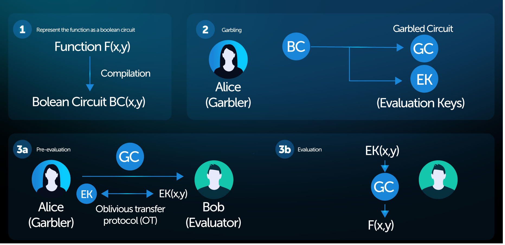

# Conceptual overview

### Garbled Circuits and how they preserve privacy 

As a privacy-preserving cryptographic technique, garbled circuits were essentially designed to solve one problem: The Millionaires problem created by Andrew Yao. In this theoretical scenario, two millionaires, Alice and Bob, want to work out which one of them is richer without disclosing their actual net worth.

To do this, they can use a garbled circuit which can be simplified into the following steps:

* **Step 1** — The problem or “function” (i.e. who is richer) is written as a type of program that uses logical gates, (aka a Boolean circuit). In the Millionaires Problem, suppose that the millionaires’ wealth can fit into 8-bit integers (recall that such integers can accommodate numbers between 0 and 2⁸-1=255). Then the Boolean circuit has 2x8=16 input wires (first set of 8 input wires \`belong’ to Alice and the second set \`belongs’ to Bob). The circuit structure is such that it takes the first and second sets of input wires, interprets them as numbers X and Y, and computes MAX(X,Y). The result goes to an output wire that encodes a single bit B. If B=0 then we have X > Y and otherwise (B=1) we have X ≤ Y.
* **Step 2** — Alice encrypts or “garbles” this Boolean circuit, the result is called Garbled Circuit. Each input wire (recall that there are 16 of them) is associated with two long and random labels L0 and L1 that represent the binary values 0 and 1, respectively. At the time of garbling, Alice has L0 and L1 for _all wires_. The goal of Alice is to give Bob the garbled circuit, along with _only a single label_ for each input wire, so that Bob will be able to compute the MAX function only once using the labels it obtains. The set of labels associated with the input wires of the garbled circuit (one label per input wire) is called a Garbled Input. In Step 3a, Alice sends the garbled circuit to Bob, including one label for each of the first 8 input wires that belong to her, and in Step 3b, Bob obtains one label per input wire of the second set of 8 input wires (that belong to him).
* **Step 3a** — Alice sends the garbled circuit to Bob along with the right labels for her 8 input wires.
* **Step 3b** — Bob “garbles” his own number and obtains 8 labels, one label for each input wire that belongs to him. Now Bob is ready for the actual computation.
* **Step 4**. Bob computes the garbled circuit on the garbled input (one label per input wire). This process outputs the bit B in the clear, so now Bob knows the result of the computation. In particular, this result does not reveal any dollar amounts, just an answer to the question of who is richer.
* **Step 5** — At this point Bob may communicate the result, B, to Alice, so she can learn which of them is richer.

This is obviously a simplified explanation, visit the [**Detailed Overview**](https://app.gitbook.com/o/-MgoVlq5Hr-DSFn\_cBMH/s/VF77VPDS2ZTopmEc1UzR/\~/changes/4/readme/detailed-overview) for a more detailed walkthrough of the process.

<figure><figcaption></figcaption></figure>
