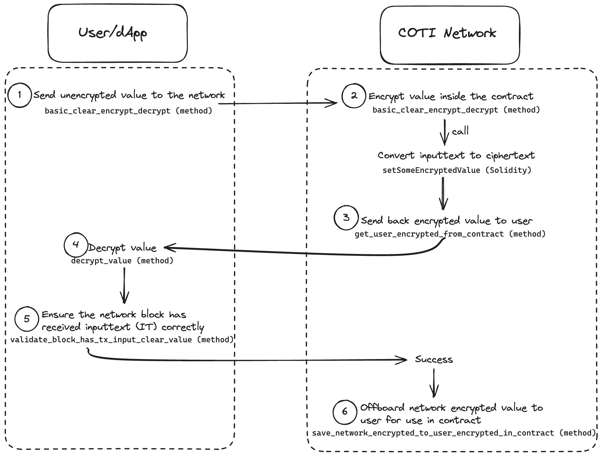

# How to Encrypt Data On-Chain

The following diagram shows a high level workflow to encrypt data on the COTI network, it assumes the following is true:

* User account has been created
* User AES key has been created

<figure><figcaption>
Flow to encrypt data on-chain
</figcaption></figure>

This is the overview of the process, using the [**data\_on\_chain.py**](https://github.com/coti-io/coti-sdk-python/blob/main/examples/data\_onchain/data\_on\_chain.py) example from the [Python SDK](https://github.com/coti-io/coti-sdk-python/tree/main) as a reference:

1. Send unencrypted value to network using method [basic\_clear\_encrypt\_decrypt](https://github.com/coti-io/coti-sdk-python/blob/main/examples/data\_onchain/data\_on\_chain.py#L172)
2. Network will encrypt it the value in the contract using method  [save\_clear\_value\_network\_encrypted\_in\_contract](https://github.com/coti-io/coti-sdk-python/blob/main/examples/data\_onchain/data\_on\_chain.py#L229).
   1. This in turn calls [setSomeEncryptedValue](https://github.com/coti-io/confidentiality-contracts/blob/ba4af39da2b02d9d4f8fdd46d3963f0fe9742a85/contracts/examples/DataOnChain.sol#L41) from the Solidity contract. This is a transitory state to make the clear value available by having it encrypted. inputtext (IT) is converted to ciphertext (CT).
3. Send back encrypted value to user using [get\_user\_encrypted\_from\_contract](https://github.com/coti-io/coti-sdk-python/blob/main/examples/data\_onchain/data\_on\_chain.py#L178).
4. Decrypt value using [decrypt\_value](https://github.com/coti-io/coti-sdk-python/blob/main/examples/data\_onchain/data\_on\_chain.py#L181)
5. Ensure the network block has received inputtext (IT) correctly using method [validate\_block\_has\_tx\_input\_clear\_value](https://github.com/coti-io/coti-sdk-python/blob/main/examples/data\_onchain/data\_on\_chain.py#L243). This ensures the relevant block has the clear value send initially by the user.
6. Take a network encrypted value, offboard it to the user for use in the contract using method [save\_network\_encrypted\_to\_user\_encrypted\_in\_contract](https://github.com/coti-io/coti-sdk-python/blob/main/examples/data\_onchain/data\_on\_chain.py#L187)
